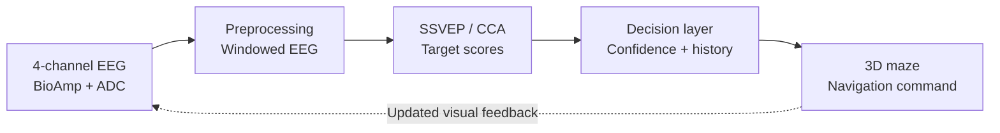

**Ongoing research under the guidance of Prof. Camille Gontier at Inria.**

I am extending an interactive 3D maze into a **four-channel EEG-based brain–computer interface (BCI)**. The aim is to translate a user's attention to flickering visual targets into navigation commands, while studying how signal quality, decoding confidence, and decision timing affect control.

The project brings together three parts: a C++/OpenGL navigation environment, a custom BioAmp acquisition assembly, and optical measurement hardware for checking the actual stimulus presented by the monitor.

<strong class="bci-label">Current status</strong> manual navigation, four frame-sequenced visual targets, optical capture tools, and raw BioAmp diagnostics are implemented. The four-channel hardware ensemble is assembled. Calibrated EEG streaming, CCA decoding, and EEG-controlled navigation remain integration and evaluation work.

---

## 1. Project goal

EEG-based control must operate with noisy signals, variability across recording sessions, and a relatively low command bandwidth. A mistaken movement can also be more disruptive than a delayed decision. This makes a maze a useful experimental setting: decoder accuracy matters, but so do the number of corrections, time to reach the goal, and efficiency of the resulting path.

The intended pipeline is:

**EEG acquisition → signal preprocessing → SSVEP feature comparison → intent decoding → confidence-aware decision → navigation command**

The decoder and navigation environment are kept conceptually separate so that signal-processing and decision strategies can be compared against the same task.

---

## 2. Four-channel EEG hardware

The acquisition assembly uses four **BioAmp EXG Pill** analog front ends. I modified the electrode wiring so the channels share a **common ground and reference**, while retaining separate signal electrodes. The BioAmp boards are covered in **Kapton tape to help prevent accidental shorting during use**.



Assembled four-channel EEG ensemble. The BioAmp boards are covered in Kapton tape to help prevent accidental shorts, and the electrode wiring has been modified to share a common ground and reference.

The intended acquisition path is:

**Signal electrodes and shared reference → BioAmp analog front ends → ADC sampling on the acquisition board → serial EEG stream → host-side processing**

The companion repository includes a five-input raw BioAmp diagnostic sketch for inspecting ADC readings. That diagnostic's input count is distinct from the four-channel EEG ensemble shown here. The current diagnostics provide a way to inspect the acquisition path; a calibrated, synchronized EEG recording pipeline still needs to be integrated and characterized.

---

## 3. SSVEP visual targets



Four directional targets in the navigation interface. A still image shows their placement, not their flicker frequency or timing accuracy.

Steady-state visual evoked potentials are neural responses associated with periodic visual stimulation. The planned interface uses four flickering targets, each linked to one navigation action:

| Target position | Intended command |
| --------------- | ---------------- |
| Top center      | Move forward     |
| Bottom center   | Move backward    |
| Left center     | Turn left        |
| Right center    | Turn right       |

The targets are fixed in screen space and alternate between black and white using different frame sequences. Static labels sit outside the flickering regions. The interface supports pausing the flicker, pauses it on victory/game-over screens, and requests vertical synchronization at startup.

The nominal stimulus frequency is:

$$
f_{\mathrm{target}} = \frac{f_{\mathrm{refresh}}}{N_{\mathrm{bright}} + N_{\mathrm{dark}}}.
$$

The same frame sequence therefore produces different frequencies on different monitors. Missed refreshes, compositor behavior, and driver settings can alter the delivered timing. **Calculated frequencies remain provisional until measured optically.**

---

## 4. Optical frequency validation hardware

To measure the stimulus actually emitted by the screen, I built a **BPW34 photodiode measurement circuit** using a **XIAO MG24** board. The photodiode is embedded in foam that was painted black and then covered with black duct tape. This enclosure is intended to block ambient light and light from neighboring targets on the monitor, helping isolate the target being measured.



Optical measurement circuit with the BPW34 photodiode embedded in foam painted black and covered with black duct tape. The shielding helps reject ambient light and illumination from adjacent monitor targets.

The firmware records buffered photodiode samples and reports frequency and timing statistics. A Python serial utility requests fresh captures and saves timestamped CSV samples and JSON reports. Host-side tests cover signal analysis and serial-transfer integrity.

The firmware has been exercised on hardware. The next validation step is to measure **every target while the maze is running under navigation load**, checking frequency stability and timing rather than relying solely on the configured frame sequence. Building the circuit and testing the analysis code do not by themselves establish optical timing accuracy.

---

## 5. Real-Time BCI Architecture

The intended system separates acquisition, decoding, and navigation. Hardware and interface components are in place; the neural-control connections below are the integration plan.

| Module            | Role                                                                  |
| ----------------- | --------------------------------------------------------------------- |
| Acquisition       | Sample the four EEG channels and deliver a host-side stream           |
| Signal processing | Filter and window the data for comparison with target references      |
| Decoder           | Estimate which visual target has the strongest supporting evidence    |
| Decision layer    | Execute, defer, or reject a command using confidence and task context |
| Environment       | Apply valid commands and record task-level outcomes                   |

---

## 6. Planned preprocessing and CCA decoding

The initial decoder will use **canonical correlation analysis (CCA)** to compare a window of multichannel EEG with reference signals at each target's frequency and harmonics. For each candidate target, CCA finds linear combinations of the EEG channels and reference signals that maximize their correlation. The resulting scores provide evidence for selecting a command.

The processing and calibration work will include:

- characterizing channel quality and recording stability;
- selecting filtering and analysis bandwidth for the chosen stimulus frequencies and harmonics;
- comparing EEG window lengths and update intervals;
- examining artifacts and ambiguous decisions;
- evaluating target-specific decoding performance using labeled trials.

Longer windows can provide more evidence but delay interaction. Shorter windows may respond faster while producing less stable decisions. The experiment will study that trade-off instead of treating a single window length as universally appropriate.

---

## 7. Confidence-aware decisions

The planned controller should act only when the leading target has enough evidence and is sufficiently separated from alternatives. One candidate rule is:

$$
i^* = \arg\max_i s_i, \qquad
u = \begin{cases}
\mathrm{command}(i^*), & s_{i^*} \geq \tau\ \text{and}\ s_{i^*}-s_{(2)} \geq \delta, \\
\mathrm{wait}, & \text{otherwise}.
\end{cases}
$$

Here, $s_{(2)}$ is the runner-up score, $\tau$ is a minimum-score threshold, and $\delta$ is the required margin. Waiting collects more evidence instead of forcing an uncertain movement.

CCA correlation scores are not calibrated command probabilities. Thresholds and score margins will therefore need to be selected and evaluated on recorded data, with attention to false activations as well as classification accuracy.

---

## 8. Temporal evidence accumulation

Successive windows can provide supporting or conflicting evidence. One candidate strategy is to smooth each target's score over time:

$$
\bar{s}_{i,t} = \alpha s_{i,t} + (1-\alpha)\bar{s}_{i,t-1}, \qquad 0 < \alpha \leq 1.
$$

Here, $s_{i,t}$ is the current score for target $i$ and $\bar{s}_{i,t}$ is its accumulated evidence. Larger $\alpha$ responds more quickly to new observations; smaller values retain more history. This is a planned comparison strategy, not an already validated controller.

The aim is to reduce isolated incorrect commands without making changes of intention excessively slow. Sustained agreement, score margins, and minimum intervals between commands are additional decision rules to evaluate.

---

## 9. Environment-aware shared control

Three planned controller variants separate decoder performance from the benefits of assistance:

| Variant                   | Command policy                                       |
| ------------------------- | ---------------------------------------------------- |
| Direct decoding           | Execute the highest-scoring target                   |
| Confidence-gated control  | Wait when evidence is weak or ambiguous              |
| Environment-aware control | Also reject movements that would collide with a wall |

This distinction matters: assistance should be evaluated for its effect on task completion and user control, rather than interpreted as an improvement in the underlying EEG classifier. Rejected commands and repeated attempts will be recorded separately from decoding errors.

---

## 10. Planned experimental evaluation

The evaluation will examine both the neural decoder and the complete navigation task.

| Level            | Planned measurements                                                                                       |
| ---------------- | ---------------------------------------------------------------------------------------------------------- |
| Optical stimulus | Measured frequency, timing stability, and behavior under navigation load                                   |
| Acquisition      | Channel quality, sampling consistency, and recording stability                                             |
| Neural decoding  | Accuracy, confusion matrix, per-command precision/recall, false activations, and cross-session consistency |
| Decision layer   | Command latency, deferred decisions, and reliability versus response time                                  |
| Navigation       | Completion rate and time, incorrect or rejected commands, number of decisions, and path efficiency         |

Information transfer rate may provide an additional communication-efficiency measure when its trial and timing assumptions match the experimental protocol. Navigation outcomes will remain necessary because classification metrics alone do not capture interactive usability.

---

## 11. Development roadmap and current status

| Stage                               | Current status                            | Next step                                          |
| ----------------------------------- | ----------------------------------------- | -------------------------------------------------- |
| Manual maze and four visual targets | Implemented                               | Measure all targets during navigation              |
| Four-channel BioAmp ensemble        | Assembled; shared ground/reference wiring | Characterize recording quality                     |
| Optical capture circuit and tools   | Implemented; hardware exercised           | Complete target-by-target timing validation        |
| Raw acquisition diagnostics         | Implemented                               | Integrate calibrated EEG streaming                 |
| Preprocessing and offline CCA       | Planned                                   | Collect labeled data and compare decoding settings |
| Online EEG navigation               | Planned                                   | Connect decoder output to the environment          |
| Confidence and shared control       | Planned                                   | Compare decision strategies and task outcomes      |

---

## 12. Original navigation environment

The maze was originally developed for **UCSB CS280 in Spring 2022** using C++, OpenGL, and FreeGLUT. It already provides collision-aware movement, mouse look, strafing and jumping, a compass and timer, and maze layouts loaded from text files.

The original game is preserved on the navigation repository's `opengl-game` branch. Its demo shows manual control and establishes the existing interactive testbed; it is not a demonstration of EEG-controlled navigation.

  <iframe width="100%" height="100%" src="https://www.youtube.com/embed/9cJ7eTtbbqo" title="Original manually controlled OpenGL maze environment" frameborder="0" allow="accelerometer; autoplay; clipboard-write; encrypted-media; gyroscope; picture-in-picture" allowfullscreen></iframe>

Original OpenGL maze demonstration, before EEG-control integration.

---

The long-term objective is a compact experimental platform for studying how neural decoding, decision confidence, and lightweight assistance interact in closed-loop navigation.

---

<strong>Thumbnail credit:</strong> Izabela Rejer and Łukasz Cieszyński, <a href="https://link.springer.com/article/10.1007/s10044-018-0758-4">“Independent component analysis for a low-channel SSVEP-BCI”</a>, <em>Pattern Analysis and Applications</em> 22, 47–62 (2019), Figure 1. Source diagram used as a resized project thumbnail under <a href="https://creativecommons.org/licenses/by/4.0/">CC BY 4.0</a>. It illustrates the general SSVEP-BCI concept; the hardware photographs and navigation screenshot above document this project.

